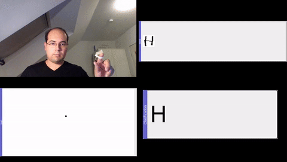
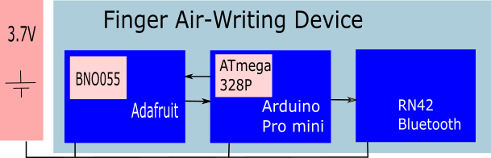

# FAirWrite application
This is a Graphical User Interface to to apply the reconstruction methods
for a handwriting’s trajectory with the use of the Finger-worn sensor. The Interface is a collection
of windows docked in a single running program, each of these windows have a different functionalities
and outputs such as the screen display of the 2-D handwriting, real time plots over time of
the incoming IMU signals, and a control menu area.

"FAirWrite" is defined as a full system implementation to intuitively record the user’s handwriting gesture on a remote screen using a built-in
Inertial Measurement Unit (IMU). is brought out as an idea for document creation in virtual and augmented reality as pens
are used with traditional papers.

User Interface distinguishes two different modes
- Normal Mode: In this mode, free writing style can be performed. The user can use all of the
blank space of the screen to generate a character or any figure. This is default mode in the
GUI.
- Word Mode: Word mode is special feature of the User Interface. It implements an image
stitching technique to generate a complete word based on the recordings of letters written
sequentially one after the other. The user still has the use of all the blank space, but it is
expected a recording of a letter or a number to generate an output of a word. The generated
word image is only based on the reconstruction technique.



## The Finger-Worn Sensor
The Finger-Worn sensor consist of ensemble of three electronic board circuits enclosed in a box
with measures of 3.5 x 3 x 1.5 cm for length, width, and height, which makes it suitable for fingerworn.
The embedded device is composed of a MEMS IMU sensor unit which detects change of
acceleration, angular rotation and magnetic field strength; a Bluetooth module for wireless communication
with a computer; a control unit to control the program execution of the sensor activity.



Other device connected to the serial port of the computer running the user interface application is capable to interact 
(not Tested) with the FairWrite by application if the following points are adapted:
- Each raw data sample transmitted by the device is converted in ASCII string in the following
form: 
```bash
<Tms> <pen> <status> ACC: <x> <y> <z> GYR: <x> <y> <z> MAG: <x> <y> <z> QUAT: <a> <i> <j> <k>
```
**Tms** is time stamp in ms.<br />
**pen** is ’0’ for pen up (not writing) or ’1’ (writing).<br />
**status** four consecutive numbers for calibration status. Starting from left to right: accelerometer,
gyroscope, magnetometer and overall system. x, y, z are the three axis data from the
accelerometer, gyroscope and magnetometer sensor in m=s2, degree=s, and uT. a, i, j, k are
the quaternion data regarding orientation if device provides it, otherwise set values to ’0.0’
for each. a is the scalar part of the vector and i; j, k are the vector part.

Example:
```bash
637353 1 ACC: -0.29 -2.13 -9.39 GYR: -1.69 -4.44 -0.06 MAG: 0.5 0.4 0.3 QUAT: 0.1122 -0.9932 0.0316 0.0059
```
- Device is connected to the computer where the GUI is running at Serial Port 4 and configured
to 115.2Kbps.
## How to run
1. Open command line
2. Move to FaiWrite/ folder
3. Execute the program by:
```bash
python fairwrite.py
```

## Dependencies
The GUI was developed using Python as the programming language, PyQt as application
framework, and PyQtGraph library for real-time plots visualization. The GUI, designed to create
a full Human Computer Interaction.Following packages should be installed:
- Python 3.7.3
- Pytorch 1.5.1
- Python packages installed:
    - pyqtgraph
    - pandas
    - logging
    - PIL
    - skinematics 
    - serial
    - pytz
    - datetime
    - logging